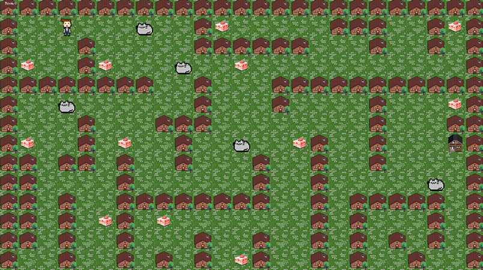

# So_Long

So_Long is a simple 2D game project developed as part of the 42 school curriculum. It aims to help students practice C programming skills such as file parsing, event handling, and graphics rendering using the MiniLibX library.

## Features

- Reads and validates map files defining walls, collectibles, player start, and exit
- Implements player movement with keyboard input
- Tracks collectibles and game progress
- Uses MiniLibX for rendering the game window and sprites

## Bonus features
- Move step on screen
- Enemy
- Sprite animation

## demo

[🎥 demo video](https://www.youtube.com/watch?v=OyAGqfAYfhA)

## Project Structure

- **src/** — Source code files
- **header/** — Header files
- **maps/** — Sample map files (`.ber` format)
- **mlx_linux/** — MiniLibX graphics library for Linux

## Requirements

- Linux environment (Ubuntu or similar)
- gcc compiler
- MiniLibX (included in the repo)
- Make

## Build

bash
make (make bonus for bonus feature)

This will compile the executable so_long (so_long_bonus).

## Run
bash
Copy
Edit
./so_long maps/example.ber
Replace example.ber with your own map file. The map file must be in the correct format (rectangular, surrounded by walls, with at least one collectible and one exit).

Controls
W/A/S/D or arrow keys to move the player

ESC to exit the game

Map Format
1 — Wall
0 — Empty space
C — Collectible
E — Exit
P — Player start position

## Notes
The game ends when the player collects all collectibles and reaches the exit.

Invalid maps will cause the program to exit with an error message.
